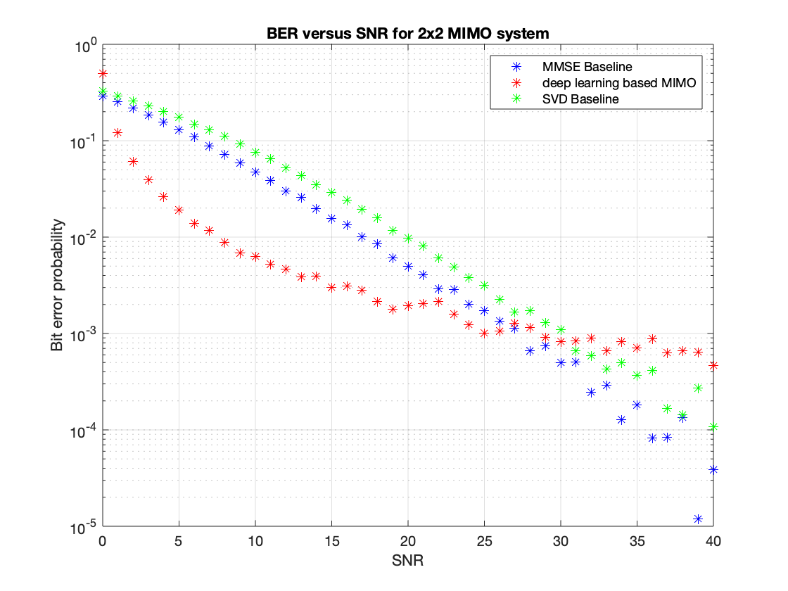

# deep_MIMO

Unofficial Pytorch implementation of Deep Learning-Based MIMO Communications (Timothy J. O’Shea) 
#### Introduction
This is the course project of Liu Haolin for CIE 6014 in CUHKSZ.<br/>
This project is running on Python 3.6 for the deep learning MIMO, and is running on Matlab 2019b for the MMSE and SVD MIMO baseline.<br/>

And it only contains 2x2 spatial multiplexing MIMO.<br/>
#### install packages
Pytorch and some other packages are required, use the following commands to install the package:
```
pip install -r requirements.txt
```
#### run the program
run the training by typing the following command:
```
python train.py --exp_name=experiment_name --gpu=0 --batch_size=6 --num_bits=2
```
after the model is trained, the weight file will be stored under ./checkpoints/experiment_name/xxx.pth
#### test your model
test the model by specifying the path of the model's weight
```
python test.py --resume=./checkpoints/experiment_name/xxx.pth --gpu=0 --batch_size=6
```
It will print the BER performance of the model under different SNR.
#### some results
The BER performance among MMSE baseline, SVD baseline, and the deep learning based MIMO is shown in the following figure:<br/>

For SNR lower than 30dB, deep learning based MIMO outperforms the baseline. However, when SNR is higher than 30dB, two baseline models works better, and MMSE baseline is the best among them.